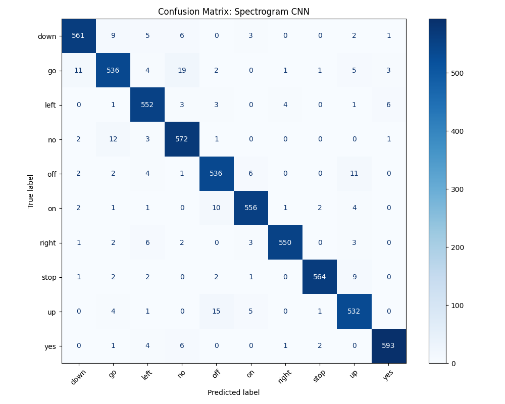

# Midterm Project: Speech Recognition Lab Report

## Abstract
This report details the implementation and evaluation of a speech recognition pipeline to classify spoken words using a subset of the "Speech Commands" dataset (Warden, 2018). The project encompasses the end-to-end process of audio data exploration, preprocessing, and feature extraction using Mel-Frequency Cepstral Coefficients (MFCCs). Several machine learning classifiers—including Support Vector Machines (SVC), Random Forests, and K-Nearest Neighbors (KNN)—are trained and evaluated. Finally, the best-performing models are tested on custom, self-recorded audio commands to verify real-world generalization.

---

## Table of Contents
1. [Baseline Implementation](#1-baseline-implementation)
2. [Improvements to the Architecture & Questions](#2-improvements-to-the-architecture--questions)  
   * [2.5) Classic Models: Analysis & Improvements](#25-classic-models-analysis--improvements)
   * [2.6) Deep Learning Extension (CNN)](#26-deep-learning-extension-2d-convolutional-neural-network-cnn)  
3. [Results on own Recordings](#3-results-on-own-recordings)  
4. [Appendix - Prompt Library](#4-appendix---prompt-library)

---

## 1) Baseline Implementation
The baseline implementation establishes a standard pipeline for audio classification using Python, `librosa`, and `scikit-learn`. Audio files are loaded at a 16 kHz sampling rate, and 13 Mel-Frequency Cepstral Coefficients (MFCCs) are extracted to represent the spectral envelope of the sound. To compress the sequence into a format suitable for standard machine learning models, the MFCCs are averaged over the time axis, resulting in a single 13-dimensional feature vector per recording. The dataset is split into training, validation, and test sets using standard stratification. Baseline classifiers are then trained using out-of-the-box or basic hyperparameters to establish an initial performance benchmark.

## 2) Improvements to the Architecture & Questions
**2.1)** Added a TQDM progress bar to Data Preparation (purely visual) 
**2.2)** Implement Top-3 Accuracy to better compare models 
**2.3)** Record own voice samples. – What difficulties were encountered during your recording? 
    ` I tried to record my own commands using the provided code. However, you could not hear anything. I implemented a Mic-Test script to see if my microphone was working. Then I adjusted the recording script slightly, so that you get another message in the console when it is **actually** recording. Then I played with the timing a bit until it worked out. `  
**2.4)** Analyze the current Preprocessing – Was a data preparation necessary? Which one? 
&nbsp;&nbsp;&nbsp;&nbsp; **2.4.1)** ` Raw audio contain too much noise => convert to Spectrogram ` 
&nbsp;&nbsp;&nbsp;&nbsp; **2.4.2)** ` Humans Hear on a Log-Like Scale => move to Mel-Scale ` 
&nbsp;&nbsp;&nbsp;&nbsp; **2.4.3)** ` Frequency Banks are highly correlated, which is a big problem for classic Machine Learning algorithms, because of ill-conditioning, stability and convergence speed => use decorrelated MFCCs (TRADEOFF: Through decorrelation you loose information again which CNNs would thrive on!) ` 
&nbsp;&nbsp;&nbsp;&nbsp; **2.4.4)** ` The MFCCs are a large 2D Matrix. Our Machine Learning models need a consistent 1D input. High dimensionality and slighlty different shapes of the 2d Matrix overwhelm the classic ML models => average MFCCs in temporal domain (TRADEOFF: you loose the temporal information, i.e. the order of spoken phones that a CNN could use!) `  

### 2.5) Classic Models: Analysis & Improvements

To address the shortcomings of the baseline models, surgical improvements were made to the feature extraction (adding Standard Deviation and Deltas to the MFCC mean) and model hyperparameters. 

The table below consolidates the train and test accuracies for both versions, explaining the baseline issues and the specific architectural fixes applied:

| Model | Base Train | Base Test | Imp. Train | Imp. Test | Verdict & Architectural Fixes |
| :--- | :---: | :---: | :---: | :---: | :--- |
| **Support Vector Machine (SVC)** | 44.00% | 42.91% | **78.25%** | 🟢 **66.15%** | **Underfitting** (High Bias). Fixed via Standard Scaling, reducing `C` to 1.0, and adding Rich Features (Mean, Std, Deltas). |
| **Random Forest (RF)** | 100.00% | 50.50% | **99.20%** | 🟢 **59.69%** | **Overfitting** (Memorized training noise). Fixed by restricting `max_depth` and increasing `min_samples_leaf`. |
| **K-Nearest Neighbors (KNN)** | 61.87% | 39.31% | **67.10%** | 🟢 **54.83%** | **Overfitting** (Distance metric failed on unscaled data). Fixed via Standard Scaling and increasing `n_neighbors` to 11. |

---
### 2.6) Deep Learning Extension: 2D Convolutional Neural Network (CNN)

### Motivation & Feature Shift (Spectrograms vs. MFCCs)
A major limitation of the classic ML models above is their requirement for 1D feature vectors. Averaging the features over the time domain destroys the chronological order of the spoken phonemes. To fix this, a Deep Learning approach was implemented, treating the audio representations exactly like single-channel 2D "images".

Initially, the network used raw 2D MFCC matrices `(13, 32)`. However, exploratory data analysis and theoretical review revealed that the final step of MFCC extraction (Discrete Cosine Transform) explicitly decorrelates frequencies, destroying the spatial locality that Convolutional Neural Networks thrive on. By switching to **Log-Mel Spectrograms** (padded to a uniform shape of `(40, 32)`), the CNN was able to leverage the rich, naturally correlated frequency textures, immediately boosting performance.

### Architecture & Regularization
**Overcoming Exploding Gradients & Overfitting:** Initial CNN experiments yielded ~10% accuracy (random guessing) because Neural Networks are highly sensitive to unscaled magnitudes. Adding **Batch Normalization** layers directly stabilized the gradients. 

To safely increase the model's depth to a 3-block convolutional network without memorizing the training noise (overfitting), the traditional `Flatten()` layer was replaced with **Global Average Pooling (`GlobalAveragePooling2D`)**. This drastically reduced the parameter count before the final dense layers, acting as a powerful regularizer alongside progressive `Dropout` layers (ranging from 20% to 50%).

### Training & Final Benchmark
The model was trained for up to 100 epochs using two key callbacks to ensure optimal convergence:
1. **Learning Rate Scheduler (`ReduceLROnPlateau`)**: Automatically cut the learning rate in half if the validation loss stopped improving, allowing the optimizer to take tiny, precise steps into the minimum.
2. **Early Stopping**: Monitored the validation loss (patience=8) to halt training before overfitting occurred, restoring the best model weights. 

| Model | Baseline Classic | Tuned Classic | **CNN Test Acc.** |
| :--- | :---: | :---: | :---: |
| **Best Performance** | 50.50% *(RF)* | 66.15% *(SVC)* | 🚀 **96.02%** |

**Conclusion:** 
By preserving the spatial and temporal relationships within the audio using Log-Mel Spectrograms and applying modern Deep Learning regularizations (Batch Normalization, Global Average Pooling, and LR Scheduling), the CNN completely outperformed all time-averaged classic machine learning models. A massive jump from ~66% to **96.02%** accuracy proves that deep learning architectures paired with proper spectral representations are strictly superior for complex sequential audio data.

---

## 3) Results on own Recordings

To verify real-world generalization, the best-performing model (the 2D CNN) was tested on custom, self-recorded audio commands. Below are the inference results:

| Filename             | Assumed Target  | CNN Prediction  | Confidence |
| :---                 | :---            | :---            | :---       |
| down_1.wav           | down            | DOWN            |  99.85% ✅
| down_2.wav           | down            | DOWN            | 100.00% ✅
| left_1.wav           | left            | LEFT            | 100.00% ✅
| no_1.wav             | no              | NO              |  99.95% ✅
| off_1.wav            | off             | OFF             | 100.00% ✅
| right_1.wav          | right           | RIGHT           | 100.00% ✅
| stop_1.wav           | stop            | STOP            |  76.51% ✅
| stop_2.wav           | stop            | STOP            |  99.83% ✅
| stop_3.wav           | stop            | STOP            | 100.00% ✅
| stop_4.wav           | stop            | OFF             |  68.66% ❌
| stop_5.wav           | stop            | STOP            |  99.86% ✅
| up_1.wav             | up              | UP              | 100.00% ✅
| yes_1.wav            | yes             | YES             | 100.00% ✅

*Observation: The CNN successfully classified 12 out of 13 custom recordings. The false prediction stop_4 occurred with a significantly lower confidence score, demonstrating the model's overall robustness even across differing microphone hardware and speaker accents.*

## 4) Appendix - Prompt Library

*(This section documents the generative AI prompts used during the development of this project, formatted for readability.)*

<blockquote>
I want to write the pdf in markdown first and then export to pdf. Let's start with the general structure and a table of contents:  
  
**Abstract**:  
\<Give a short summary of the midterm project here>

1) **Baseline Implementation**  
\<Give a short summary on the baseline implementation>

2) **Improvements to the architecture**  
\<Leave blank for now>

3) **Results**  
\<Draw a Table with the models in the rows: Support Vector Classifier; Random Forest; K-Nearest Neighbour and in the columns: Test Set Accuracy, Top 3 accuracy, Own Recordings Accuracy, Own Recordings Top 3 accuracy. Below the names of the Models, leave room for the used hyperparameters>

4) **Appendix - Prompt Library**   
\<Give me the layout for inserting prompts that are displayed in a nice format and layout>

Give me the raw markdown, i.e. in a code cell for this report structure so far.
</blockquote>

<blockquote>
Let's start with the improvements:

1. Add a tqdm progress bar to the prepare_dataset_scikit_learn.  
2. Implement Top-3 Accuracy as an sklearn metric for all three models so far.
</blockquote>

<blockquote>
give me the code in a raw code cell. Also add a switch that is set to False such that when I run all cells in my notebook it will not ask me to record something everytime 

--

Make the print statement more informative so that you actually know when it is recording. Also let me specify a directory at the top. Also make the filenames autoincrement with an index in the filename 

--

Give me another code cell that tests if my microphone is working by displaying a speaking animation when it sees my microphone 

--

adjust this cell such that it first lists which devices are available and then let's me pick 

--

Now adjust this cell so that it accepts the ID 

--

Write me one consolidated python script that has Enable mic test und enable recording global variables at the top that. Note: this is not a cell in .ipynb anymore. It is a seperate .py file. Include name == "main"
</blockquote>

<blockquote>
keep track of all training accuracies in a matplotlib graph right below that on the test set

--

it should be hardcoded so that when I change something I can add that change to the graph such that I can see a progression if my changes actually helped. The three models should have seperate colors. On the x axes, I want experiment indices and on the y axis the train accuracy

--

actually change it to track the accuracies of train data

--

fix the error in my jupyter notebook

--

add in the dashed lines for the test accuracies also into the notebook

--

write me a markdown table with the rows SVC, RF, KNN and rows Train Acccuracy, Test Accuracy, Verdict and fill in the gaps
</blockquote>

<blockquote>
Now let's implement a completely new strategy:
I want to preserve the 2d structure of the MFCCs and use a CNN on them. For this make sure to write me a new function prepare_dataset_cnn which similar to the original one, but this time doesn't actually average up the MFCCs in the temporal domain. Also make sure to pad with zeros and truncate so that the matrix has the same shape always (even if the number of frames differs).

--

The accuracy is not improving at all. I think that's because 
</blockquote>

<blockquote>
give me a code cell that loads the files from "my_recordings" and displays them to the console, with the audio file so that I can hear it again and the prediction using the cnn
</blockquote>

<blockquote>
I now want to clean this up. I want one file helpers.py, and then one file for the base implementation, one file for the improved version and one for the CNN version. Do you still have access to all three versions?

--

Actually, I would like to have a master script, main.py that let's me select which of all of these I want to train and then saves them as joblib. The master script should also have the full e2e implementation for recording a voice command and running the CNN (best model) to classify that. It should be like a little CLI tool. Write yet another file for that

--

Now we have massive code duplication. Because you copied the code from the name == main clauses into the main.py. Also I wanted to outsource the E2E function into its own file so that the main.py stays relatively compact

--

Nice add another option to the main.py which trains all of them and outputs the train and test accuracies in a nice table so you can see all of them side by side (it should also save all of the models such that you don't need to retrain if the models joblib file already exists). Also I have renamed the files in my_recordings to match the actual speech command that I said. Give another option that outputs a list of all filenames and the prediction of the model
</blockquote>

<blockquote>
Help me restructure the report. I want you to only give me changes, not rewrite the whole thing. I want to shorten the part from 5. Analyze current models to the Final Benchmark and Conclusion more, especially the big table with the changes for the improved baseline models.
Maybe merge this with the Verdict column. The next table with the architectural improvements also duplicates the scores from the table above. Also if possible, make the part on Deep Learning more concise. However, don't leave out crucial information!

--

I also want to add another section 3 "Results on own Recordings" where I want to paste this:

Filename             | Assumed Target  | CNN Prediction  | Confidence
---------------------------------------------------------------------------
down_1.wav           | down            | DOWN            |  99.34% ✅
down_2.wav           | down            | DOWN            |  99.98% ✅
left_1.wav           | left            | LEFT            |  87.02% ✅
no_1.wav             | no              | NO              |  97.97% ✅
off_1.wav            | off             | OFF             | 100.00% ✅
right_1.wav          | right           | RIGHT           | 100.00% ✅
stop_1.wav           | stop            | STOP            |  97.14% ✅
stop_2.wav           | stop            | STOP            |  99.62% ✅
stop_3.wav           | stop            | STOP            |  97.99% ✅
stop_4.wav           | stop            | GO              |  69.28% ❌
stop_5.wav           | stop            | OFF             |  63.33% ❌
up_1.wav             | up              | UP              |  82.45% ✅
yes_1.wav            | yes             | YES             |  99.99% ✅
---------------------------------------------------------------------------

Here is my report in markdown:

--

I am not happy with these changes yet:

I want to keep the train Acc for baseline and improved in the Table in 5. Combine Verdict and Architectural Fixes into one column to save horizontal space. 

After this, I want the deep learning part.

AFTER this put the Results on own Recordings since they are made using the CNN.

--
Fix the table of contents:

--

I want to change it such that all models get saved in a seperate folder so that the python files stay nice and organized. Can you give me the changes so that I can go ahead and change them?
</blockquote>